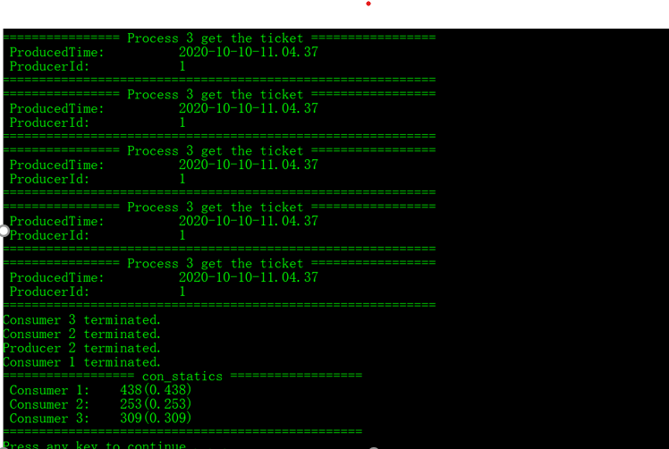
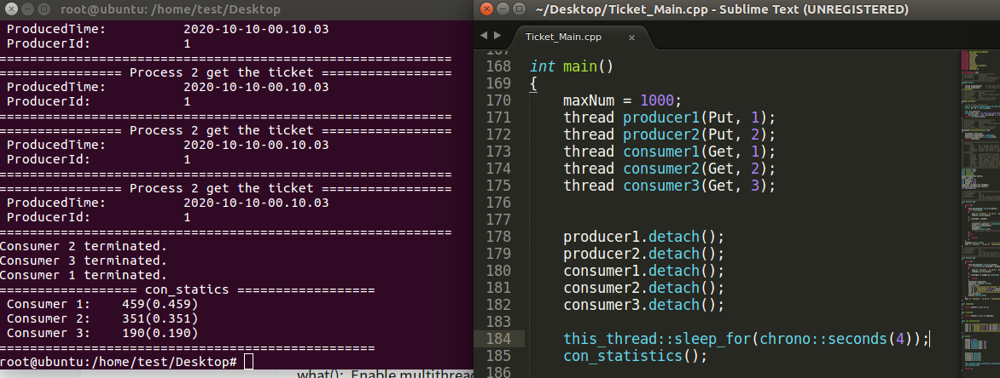

#### C++多线程编程简单实例

1. 描述：本实例实现简单的生产者-消费者模型。

   以售卖车票为背景，两个生产者向票池中放票，三个消费者从票池中取票。

   有产票总量限制，当生产者生产的票数之和等于产票总量上限时，生产者线程退出。

   当生产者线程退出之后，且票池被取空时，消费者线程退出。

   考虑三个消费者的**线程优先级**，因此Windows版本源码和Linux版本源码不兼容。

   使用C++11标准，使用`thread`类实现。

2. 使用方式：

   * Windows下VS2017可以编译通过
   * Linux下使用如下两条命令执行：
     * `g++ -std=c++11 -pthread -o ticket Ticket_Main_Linux.cpp`
     * `./ticket`

3. 运行结果

   

   

   